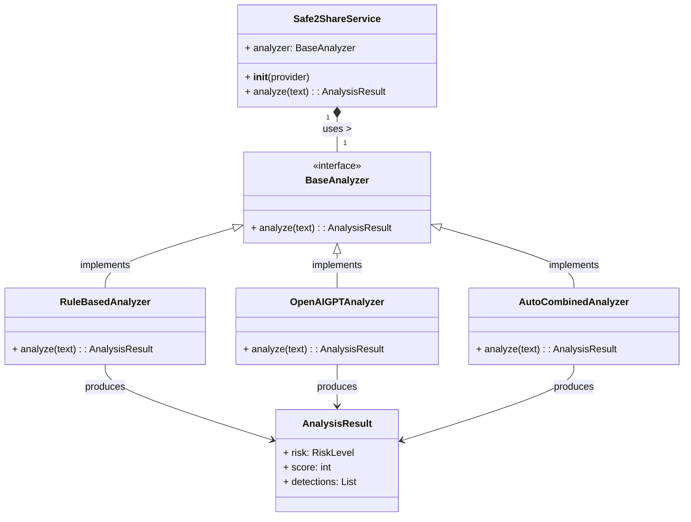
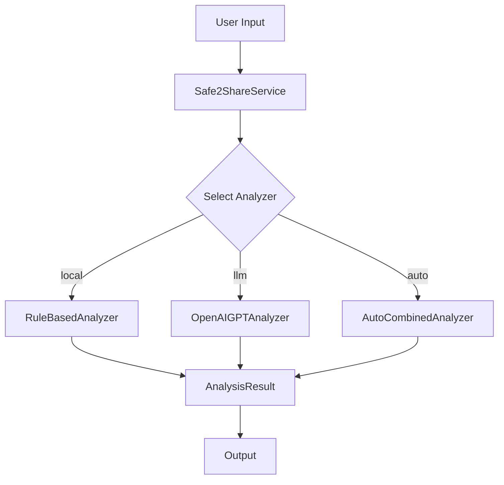

# 🛡️ Safe2Share AI: Confidentiality Guard for AI Workflows

[](https://www.python.org/)
[](https://fastapi.tiangolo.com/)
[](https://docs.pytest.org/)
[](LICENSE)

Local-first Confidential Information Checker that analyzes text before it is shared with AI tools or external services. Includes rule-based detection, optional AI analyzer, FastAPI demo, and extensible architecture.

## Quickstart (Local + Browser UI)

Safe2Share can be used in **three ways**:

### 1) Run the Web UI (recommended demo)

```bash
uvicorn safe2share.api:app --reload
```

Open in browser:

```
http://127.0.0.1:8000/
```

Paste text → choose provider → click **Scan**.

---

### 2) CLI – Local rules (offline & fast)

```bash
python -m safe2share "My password is 12345" --provider local
```

Scan a file:

```bash
python -m safe2share --file notes.txt --provider local --json
```

---

### 3) CLI – Local AI (Ollama)

Install Ollama: [https://ollama.com](https://ollama.com)
Pull a model:

```bash
ollama pull llama3.1
```

Set environment:

```bash
export S2S_LLM_BASE_URL=http://127.0.0.1:11434/v1
export S2S_LLM_MODEL=llama3.1:latest
```

Run:

```bash
python -m safe2share "My password is 12345" --provider llm --json
```

-----

## 1\. Project Overview

Safe2Share AI is a **confidentiality analysis service** designed to act as a crucial gatekeeper *before* text is submitted to external or proprietary AI systems (like OpenAI, Claude, or internal LLMs).

Its primary purpose is to **mitigate data leakage** by identifying sensitive information—such including personal data, academic or institutional data, credentials, and proprietary code—and providing immediate, actionable guidance to the user.

### Aligned with Responsible AI & Privacy

  * **Responsible AI:** The project enforces the principle of **privacy by design**. Instead of relying on a black-box AI to police sensitive data, Safe2Share aims to use predictable rules and clear risk scoring to prevent the exposure of data to *any* downstream system, promoting ethical and safe use of GenAI tools.
  * **University Context:** This tool directly addresses confidentiality risks within an academic setting where sensitive student or research data must never leave a secure environment. It supports staff and students in safe prompt engineering practices.

-----

## 2\. Why This Project Matters (Addressing Confidentiality Risks)

The integration of AI into modern workflows presents a critical new attack vector: **accidental data exposure via prompts.**

Safe2Share AI is a proof-of-concept that demonstrates a scalable solution to this risk:

1.  **Eliminates Accidental Exposure:** By analyzing text *locally* (via the Rule-based analyzer) or securely (via a configurable API), the tool guides users to redact sensitive details, ensuring clean, safe inputs for the AI system.
2.  **Mitigates Hallucinations:** The project addresses the core AI challenge of **hallucinations** indirectly. Since the output of the *Analyzer* is deterministic and auditable, it is a **trustworthy source** for security decisions, unlike relying on an LLM for classification.
3.  **Supports Developer Workflow:** It provides both a powerful **CLI** for batch processing and a **FastAPI** endpoint for easy integration into web applications or CI/CD pipelines.

-----

## 3\. Architecture Overview & Features

Safe2Share AI is built on the **Strategy Pattern** to achieve **Modularity** and **Separation of Concerns**. This design allows the core service logic to seamlessly swap analysis engines without modification.

### System Structure Diagram (UML Class Diagram)

This diagram illustrates the structural relationships inherent in the **Strategy Pattern**:



### Core Architecture Components

  * **Strategy Pattern:** The `Safe2ShareService` (Context) delegates the analysis task to different `Analyzer` implementations (Strategies).
  * **BaseAnalyzer (Interface):** Defines the contract (`analyze(text) -> AnalysisResult`).
  * **RuleBasedAnalyzer (Concrete Strategy):** **Local, deterministic, and always available.** Uses regex and keywords to calculate risk (0-100 score). This is the default, most private, and fastest mode.
  * **OpenAIGPTAnalyzer (Concrete Strategy):** Uses the OpenAI API (or a configurable local LLM) for enhanced, contextual classification.

### System Flow Diagram (Mermaid Flowchart)

The flowchart below illustrates how the Strategy Pattern handles the analysis path decision:



-----

## 4\. Usage Examples and Run Commands ⚙️

### A. Command Line Interface (CLI)

The CLI provides a lightweight way to process text directly from the terminal. All commands must be run from the project root directory.

| Mode | Command | Description |
| :--- | :--- | :--- |
| **Default (Rule-Based)** | `python -m safe2share "My password is 12345" --provider local` | Uses the local, privacy-preserving Rule-Based analyzer. |
| **LLM Provider** | `python -m safe2share "Confidential doc..." --provider llm` | Uses available LLM models to analyze the input. |
| **Auto** | `python -m safe2share "..." --provider auto` | Uses local first then optional escalation. |

### B. FastAPI Web Service (API)

The FastAPI server exposes the analysis functionality via a web endpoint.

1.  **Start the Server:**
    Run this command from the project root to start the server with auto-reloading:

    ```bash
    uvicorn safe2share.api:app --reload
    ```

2.  **Access Documentation:**
    Once running, access the interactive documentation (Swagger UI) here:

    `http://127.0.0.1:8000/docs`

3.  **Feed Data (cURL Example):**
    Use the `/analyze` endpoint by sending a POST request with a JSON body:

    ```bash
    curl -X 'POST' 'http://127.0.0.1:8000/analyze' \
      -H 'Content-Type: application/json' \
      -d '{"text": "The project uses my old SSH key: abc123def456"}'
    ```

-----

## 5\. Feature Details and Output Structure

### Risk Classification

The service assigns a numerical score (0-100) and a risk level to every input

[Image of Risk Assessment Matrix]
.

| Feature | Description | Demonstration of Skill |
| :--- | :--- | :--- |
| **Risk Classification** | Assigns a numerical score (0-100) and risk level (PUBLIC, INTERNAL, CONFIDENTIAL, HIGHLY\_CONFIDENTIAL). | **Privacy/Risk Reasoning** |
| **Local vs. AI Mode** | Easily toggle between the local, private **Rule-Based engine** and the contextual **AI engine**. | **Responsible AI & Modularity** |
| **Suggested Rewrites** | Provides a redacted version of the text to guide users toward safer prompts. | **Workflow Improvement** |
| **Modular Design** | Analyzer logic is completely separated from the FastAPI routing and Service logic, supporting **future extension**. | **Clean Architecture & Maintainability** |

### Example Output (JSON/CLI)

```json
{
  "risk": "HIGHLY_CONFIDENTIAL",
  "score": 90, 
  "reasons": [
    "Found keyword 'SSH key' with sensitivity HIGHLY_CONFIDENTIAL (Score: 90)"
  ],
  "detections": [
    {
      "label": "HIGHLY_CONFIDENTIAL",
      "span": "SSH key: abc123def456",
      "score": 90
    }
  ],
  "suggested_rewrites": [
    "The project uses my old [REDACTED]."
  ]
}
```

-----

## 6\. Tech Stack

  * **Core Language:** Python 3.11+
  * **API Framework:** **FastAPI** (Optional web service layer, demonstrates ability to use modern frameworks beyond Django)
  * **Data Models:** **Pydantic** (Strong type hinting and validation for API contracts)
  * **Testing:** **Pytest** (Unit and integration testing)
  * **AI Integration (WIP):** `openai` library

-----

## 7\. Testing

The project uses `Pytest` to ensure core logic, especially the complex scoring and aggregation heuristics, are correct. This highlights a commitment to **maintainable, modular software** via TDD principles.

### How to Run Tests

From the project root:

```bash
pytest
```


## 8\. Limitations & Future Enhancements

  * **Local LLM support via Ollama (OpenAI-compatible)** — already implemented, enabling private offline AI scanning.
  * **Improved Classification:** Integrate **Named Entity Recognition (NER)** models to replace simple regex, greatly improving accuracy on contextual PII.
  * **UI/UX Expansion:** Develop a simple JavaScript frontend to demonstrate **real-time analysis** for browser-based applications.
  • Rule engine expansion for detecting generic secrets (tokens, API keys, short credentials)

-----

## 9\. Appendix: AI Terminology Cheat Sheet

| Term | Definition |
| :--- | :--- |
| **GenAI (Generative AI)** | Any AI capable of generating new content (text, images, code, etc.) rather than just classifying or predicting existing data. |
| **LLM (Large Language Model)** | A type of **GenAI**, trained on vast datasets, capable of understanding and generating human-like text (e.g., GPT-4, Llama). |
| **Hallucinations** | Instances where an LLM generates factually incorrect, nonsensical, or fabricated information with high confidence. This is why a deterministic analyzer is a **trustworthy source** for security decisions. |
| **Responsible AI** | The practice of designing, developing, and deploying AI systems ethically, fairly, and with full consideration for **privacy**, safety, and societal impact. |
| **Prompt Engineering** | The art and science of carefully crafting input text (prompts) to guide an LLM toward a desired, accurate, and safe output. |
| **Local vs Remote Inference** | **Local inference** runs the AI model entirely on the user's machine (high privacy, slower). **Remote inference** runs the model on a third-party server (fast, high dependency risk). |