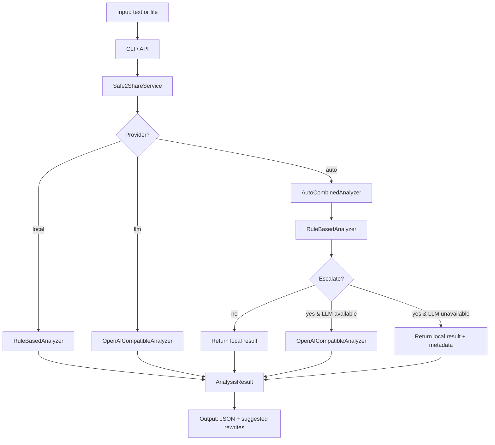
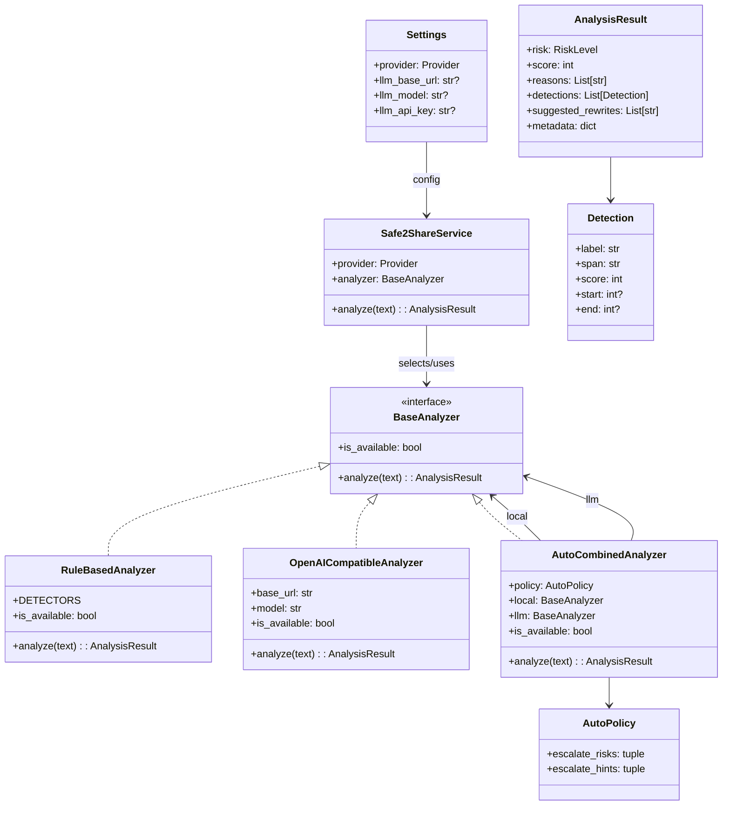

# Safe2Share Architecture

Safe2Share is built using a Strategy-based modular design that cleanly separates:

• orchestration  
• detection engines  
• policy logic  


## Core Components

### Safe2ShareService (Orchestrator)

Selects analyzer strategy based on provider:

• LOCAL → RuleBasedAnalyzer  
• LLM → OpenAICompatibleAnalyzer  
• AUTO → AutoCombinedAnalyzer  

Provides single `analyze(text)` entrypoint.


### Analyzer Interface

All analyzers implement:

```python
analyze(text) -> AnalysisResult
is_available -> bool

```

This allows seamless swapping of detection engines.


### RuleBasedAnalyzer

Deterministic regex-based detection engine:

• secrets  
• credentials  
• PII  
• cryptographic artifacts

Local-first and always available.


### OpenAICompatibleAnalyzer

LLM-powered semantic classifier supporting:

• Ollama (local)  
• OpenAI  
• Azure OpenAI  
• any OpenAI-compatible endpoint


### AutoCombinedAnalyzer

Policy-based orchestrator that:

1.  runs local analysis
2.  evaluates escalation rules
3.  optionally invokes LLM
4.  safely falls back if unavailable


## System Flow Diagram



## UML Class Diagram




## Packaging

Safe2Share is distributed as a Python package with:

• CLI entrypoint  
• API server entrypoint  
• editable install for development


##  Testing Strategy

• rule engine unit tests  
• auto escalation policy tests  
• provider failure handling


This architecture enables future additions such as:

• ML classifiers  
• RAG policy engines  
• file scanning pipelines  
• agentic workflows